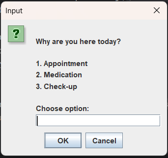

# Clinic-management-system
Java-based clinic management system with patient queue and priority handling.

## Features

## Note: Registering a new file won't be stored in Java code but file number will increment.

- Patient registration with simple GUI user interface.
- Requires an existing patient_id to continue.
-  An option to register a new file is available
-  System begins with 20 current files.
  
  ## Queue management 
  
  - System tracks reasons for patient visit.
- Handles walk-ins and appointments
- Records patient symptoms temporarily
  
- Priority patient handling (Urgent, High, low, and medium)
  
  ## Staff only
  
- Staff views critical details sent to console
- Console interface is for staff only
- Designed to avoid scaring patients
    
-  Patient interaction system sends a reassurance message to waiting patients.

  
## Tools Used
- Java
- IntelliJ IDEA 
- Scanner Class 
- JOptionPane
- ArrayLists

## How To Run
1. Open the project in IntelliJ IDEA 
2. Run the main Java file
3. Follow the prompts

## Future Improvements 
- Database integration 
- GUI improvements
- Appointment scheduling

  ## MySQL Workbench connected to IntelliJ IDEA

## Screenshot

